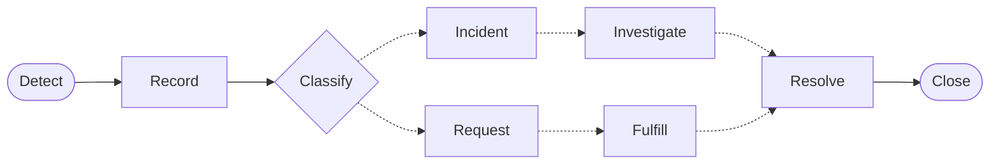
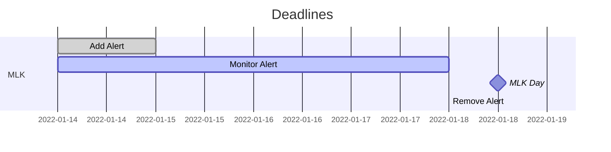
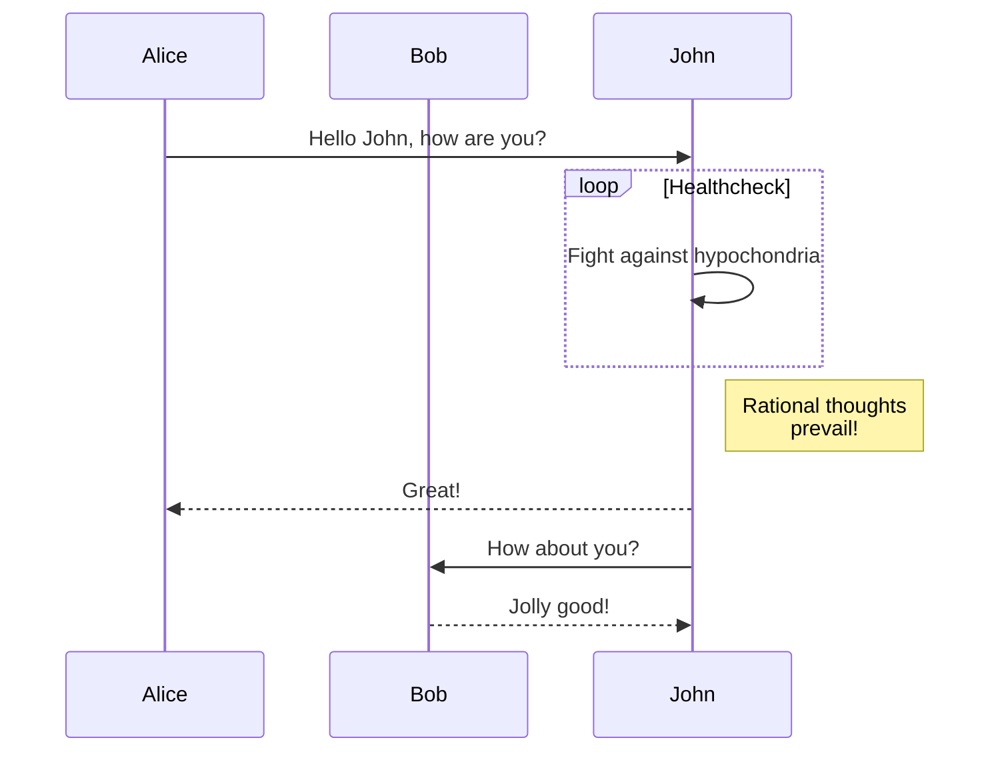
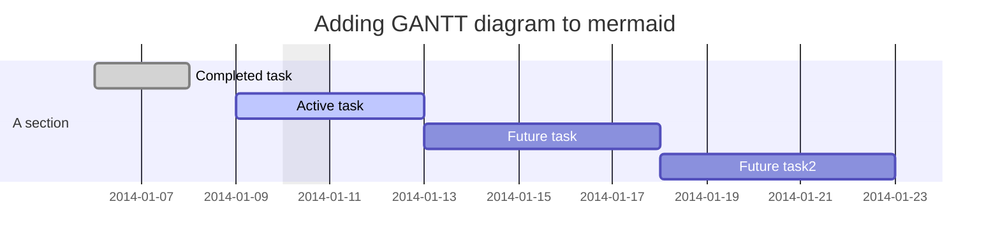

# Web Development Resources

## Table of Contents (WIP) 
- [Training](#training-runningdash)
- [Websites and Website Information](#lock-websites-and-website-information-key)
- [Naming Conventions](#naming-conventions-clipboard-personal-preferences)
- [Terminology](#terminology-blue_book)
- [Shortcuts](#shortcuts-shipit)
- [ITSM Standards](#itsm-chart_with_upwards_trend-standards)
- [Asana Tracking Standards](#asana-)
- [Personal UX Standards](#personal--ux-standards)
- [SVG](#svg-art) (WIP**)
- [Helpful Links](#helpful-links) (WIP **)

**WIP = Work in Progress
<!--
- Accessibility
- Design
- Development (WIP)
- Git
- Troubleshooting on JSFiddle
- Map
--> 

## Training :running::dash:
<!-- <details><summary>List of Elements</summary> -->
 
 - [x] [FERPA Basics - PRV802](https://mytraining-ufshands.sumtotal.host/core/pillarRedirect?relyingParty=LM&url=app%2Fmanagement%2FLMS_ActDetails.aspx%3FActivityId%3D35029%26UserMode%3D0)
 - [x] [Review FERPA Information](https://registrar.ufl.edu/ferpa/)
 - [x] [Protecting Social Security Numbers & Identity Theft Prevention - PRV804](https://mytraining-ufshands.sumtotal.host/core/pillarRedirect?relyingParty=LM&url=app%2Fmanagement%2FLMS_ActDetails.aspx%3FActivityId%3D34915%26UserMode%3D0)
 - [x] [Protecting UF: Information Security Training](https://mytraining-ufshands.sumtotal.host/core/pillarRedirect?relyingParty=LM&url=app%2Fmanagement%2FLMS_ActDetails.aspx%3FActivityId%3D49729%26UserMode%3D0)
     - [x] [UFIT Acceptable Use Policy](http://www.it.ufl.edu/policies/acceptable-use/acceptable-use-policy/)
 - [x] [PCard Refresher for Cardholders](https://mytraining-ufshands.sumtotal.host/core/pillarRedirect?relyingParty=LM&url=app%2Fmanagement%2FLMS_ActDetails.aspx%3FActivityId%3D19721%26UserMode%3D0)
 - [x] [Compliance and Ethics: Doing your part for the Greater Good](https://mytraining-ufshands.sumtotal.host/core/pillarRedirect?relyingParty=LM&url=app%2Fmanagement%2FLMS_ActDetails.aspx%3FActivityId%3D40578%26UserMode%3D0)
 - [x] [Maintaining a Safe and Respectful Campus](https://mytraining-ufshands.sumtotal.host/Core/pillarRedirect?relyingParty=LM&url=core%2Factivitydetails%2FViewActivityDetails%3FActivityId%3D36050%26UserMode%3D0)
 - [x] Blue Man - Review of EM Protocols
 - [x] [BEC Active Shooter - DEM827](https://mytraining-ufshands.sumtotal.host/Core/pillarRedirect?relyingParty=LM&url=core%2Factivitydetails%2FViewActivityDetails%3FActivityId%3D651%26UserMode%3D0)
 - [x] [At-Risk for Faculty & Staff Kognito Training](https://mytraining-ufshands.sumtotal.host/Core/pillarRedirect?relyingParty=LM&url=core%2Factivitydetails%2FViewActivityDetails%3FActivityId%3D50498%26UserMode%3D0)
 <br><br><br>
 - [ ] [(Optional) Get eduroam on mobile device](https://it.ufl.edu/ict/documentation/network-infrastructure/wireless/)
 
<!-- </details> -->
<strong><a href="#web-development-resources"><g-emoji class="g-emoji" alias="arrow_up" fallback-src="https://github.githubassets.com/images/icons/emoji/unicode/2b06.png">⬆</g-emoji> Back to Top</a></strong>
 
## :lock: Websites and Website Information :key:
<!-- <details><summary>Collection</summary> -->
  <p>Websites
    <ul>
      <li><a href="https://admissions.ufl.edu">Admissions</a></li>
      <li><a href="https://admissions.ufl.edu/blog/">Admissions Blog</a></li>
      <li><a href="https://em.ufl.edu">Enrollment Management</a></li>
      <li><a href="https://registrar.ufl.edu/">Registrar</a></li>
      <li><a href="https://veterans.ufl.edu/">Veterans Affairs</a></li>
    </ul>
  </p>
  <p>Website Information
    <ul>
      <li><a href="https://net-services.ufl.edu/cgi-bin/domain-info.cgi">Check UF Domain Information/Contact</a></li>
    </ul>
  </p>
  <p>Slate
    <ul>
      <li><a href="https://my.admissions.ufl.edu/manage/">Slate Emails</a><br><sup>For forms that create emails, include captcha to reduce spam (However, this is not ADA friendly)</sup></li>
      <li>
        <article>
          <p>You can now find two generic email templates in the Templates/ Email folder located in Slate. One version includes a placeholder for a banner image, the other version does not.</p>
          <p>To change the image, button text, or hyperlink: simply double click on the image or button and enter in your new name (text), link text, etc.</p>
          <p><i><cite>Michael Merritt</cite></i></p>
          <p>Here are the links:
            <ul>
              <li><a href="https://my.admissions.ufl.edu/manage/deliver/mailing?id=bbb7bb38-74ff-4632-a1a1-d937b16a94df" target="_blank">Generic Email Template With Banner Image</a></li>
              <li><a href="https://my.admissions.ufl.edu/manage/deliver/mailing?id=5fcb7b0a-11f3-4344-b552-5be57cfe65b8" target="_blank">Generic Email Template Without Banner Image</a></li>
            </ul>
          </p>
        </article>
      </li>
    </ul>
  </p>
  <p>Web Content Accessibility Guidelines
    <ul>
     <li><a href="https://www.w3.org/TR/WCAG22/">Web Content Accessibility Guidelines (WCAG) 2.2</a></li>
    </ul>
  </p>
<!-- </details> -->
<strong><a href="#web-development-resources"><g-emoji class="g-emoji" alias="arrow_up" fallback-src="https://github.githubassets.com/images/icons/emoji/unicode/2b06.png">⬆</g-emoji> Back to Top</a></strong>

## Naming Conventions :clipboard: (Personal Preferences)
- **_camelCase_** for variables, classes and smaller-scoped items
    - camelCaseExample
- **_PascalCase_** for globals, constants and classes that are objects (programming)
    - ClassForCodeReuse
- **_underscores_** for images
    - underscore_example.jpg
- **_dashes_** for filenames/folders
    - filename-or-folder-example
    
<strong><a href="#web-development-resources"><g-emoji class="g-emoji" alias="arrow_up" fallback-src="https://github.githubassets.com/images/icons/emoji/unicode/2b06.png">⬆</g-emoji> Back to Top</a></strong>

## Terminology :blue_book:

<!-- <details><summary>Collection</summary> -->
  <ul>
    <li><b>EM</b>
     <p><b>Container</b>: Box that holds content in a mockup, prototype, webpage, etc.</p>
     <p><b>Mockup</b>: A draft visual representation of a design</p>
     <p><b>Yield</b>: Period in which students get accepted and decide on where to go to university</p>
      <p>Specialized Terms:</p>
      <ul>
        <li>Designers
          <details><summary><i>Example Cases for Copy</i></summary>
            <ul>
              <li><b>Hyphen</b>
                <p>Never split words with hyphens</p>
              </li>
              <li><b>Leading</b>
                <p>Leading, or line-height, should be smaller on <code>p</code> elements if possible</p>
              </li>
              <li><b>Specs</b>
                <p>A design with exact measurements and colors defined and listed for reference</p>
              </li>
              <li><b>Orphan</b>
                <pre>
    ~~~
    ~~~
~~~   
 x
                </pre>
              </li>
              <li><b>Runt</b>
                <pre>
     x
~~~ ~~~
~~~
~~~
                </pre>
              </li>
              <li><b>Widow</b>
                <pre>
     x
    ~~~
~~~ ~~~
~~~
                </pre>
              </li>
            </ul>
          </details>
        </li>
        <li>Web Developers
          <ul>
            <li><b>Signifiers/Affordances</b>:
              <p>These are <i>indicators</i> that show users how to interact with new objects/situations</p>
            </li>
          </ul>
        </li>
      </ul>
    </li>
  </ul>
<!-- </details> -->

<!-- title: attribute of any HTML element but is most useful for interactive elements. They are usually defaulted as tooltips-->
<!-- Tip: Add cursor: pointer; to actual a element and not just onto a state of a -->

<strong><a href="#web-development-resources"><g-emoji class="g-emoji" alias="arrow_up" fallback-src="https://github.githubassets.com/images/icons/emoji/unicode/2b06.png">⬆</g-emoji> Back to Top</a></strong>

## Shortcuts :shipit:

| Windows | Web Browser | Xd | Zoom | VS Code |
| :---: | :---: | :---: | :---: | :---: |
| Screen Record<br> `Win + Alt + R` | Recover Tab<br> `Ctrl + Shift + T` | Scroll Horizontally<br> `Shift + Scroll` | Hide Bar (for remote IT help)<br> `Ctrl + Alt + Shift + H` | Open all files/folders from current directory in VS Code from Command Line<br> `code .` | 
| Screen Capture<br> `Win + Shift + S` | |Select items over area<br> `Shift + Click/Drag`| Microphone Toggle<br> `Alt + A` | |
|Narrator(SR)<br> `Win + Ctrl + Enter`| | | Share Screen Prompt<br> `Alt + S` | |

<strong><a href="#web-development-resources"><g-emoji class="g-emoji" alias="arrow_up" fallback-src="https://github.githubassets.com/images/icons/emoji/unicode/2b06.png">⬆</g-emoji> Back to Top</a></strong>

## ITSM :chart_with_upwards_trend: Standards
### Workflow 🥚:hatching_chick::hatched_chick::baby_chick: Process


### Incident 👷🏗️ Triage

|   | Low Impact | Medium Impact | High Impact |
| :---: |  :---: | :---: | :---: |
| High Urgency | 3 | 4 | 5 |
| Medium Urgency | 2 | 3 | 4 |
| Low Urgency | 1 | 2 | 3 |

*Impact: Number of users/items affected/influenced*<br>
*Urgency: Based on time until significant impact*

<strong><a href="#web-development-resources"><g-emoji class="g-emoji" alias="arrow_up" fallback-src="https://github.githubassets.com/images/icons/emoji/unicode/2b06.png">⬆</g-emoji> Back to Top</a></strong>

## Asana 👥

| Category | Expectation |
| :---: | :---: |
| Task | Type(scope): Small amount of words |
| Assignee | Auto-populated |
| Due Date | Set by whom? Procedure needed |
| Priority | Monochromatic/How many levels? |
| Task Progress | Color-coded/Words used? |
| Related Branch |Git Branch being used |
| Job Type | This can be discussed. Examples are Accessibility, New Page, Housekeeping, Content |
| Requested By | This can be auto-populated with a form |

* Priority: Current use is 
    * 🟨:Low 
    * 🟧:Med 
    * 🟥:High
* Task Progress: Current use is 
    * 🟦: In Queue 
    * :black_square_button:: In Progress 
    * 🟨 (lighter tone): Waiting/On Hold 
    * 🟧: Revisions Requested 
    * 🟥: Ready for Review/On Test Site 
    * 🟩: Completed/Published
    
<strong><a href="#web-development-resources"><g-emoji class="g-emoji" alias="arrow_up" fallback-src="https://github.githubassets.com/images/icons/emoji/unicode/2b06.png">⬆</g-emoji> Back to Top</a></strong>

## Personal 💀 UX Standards 
  
<details><summary>Nav</summary>
    Confirmations Needed: 
    <ol>
     <li>Submenu/Search expands on click if collapsed</li>
     <li>Submenu/Search collapses on click if expanded</li>
     <li><code>aria-expanded</code> value matches these states</li>
     <li>Keyboard navigation from these items does not close the item unless another item is focused</li>
     <li>Clicks outside button and menu/form close the item</li>
    </ol>
</details>

<details><summary>Outbound Icons</summary>
    Confirmations Needed: 
    <ol>
     <li>Outbound Icons accompany aria-label's announcing link is outbound</li>
     <li>When link is in nav/sidenav, icon is aligned right and vertically centered</li>
     <li>When link is a button, icon is aligned 4px to the right and baseline (vertically aligned icon bottom and text bottom)</li>
    </ol>
</details>
  
<strong><a href="#web-development-resources"><g-emoji class="g-emoji" alias="arrow_up" fallback-src="https://github.githubassets.com/images/icons/emoji/unicode/2b06.png">⬆</g-emoji> Back to Top</a></strong>

## SVG :art:
 
<i>Common svg commands for paths</i>:<br>
| Letter | Command | Syntax |
| :--: | :--: | :--: |
| M | Move To | M x y (or) m dx dy |
| L | Line To | L x y (or) l dx dy |
| H | Horizontal | H x (or) h dx |
| V | Vertical | V y (or) v dy |
| Z | Close Path | Z (or) z (no difference)<br>Draws straight line from current point<br>to first point in path.<br>Doesn't need to be at end of path.|
| C | Cubic Curve| C x1 y1, x2 y2, x y (or) c dx1 dy1, dx2 dy2, dx dy|
| Q | Quadratic Bezier Curve | Q x1 y1, x y (or) q dx1 dy1, dx dy |
| S | Several Curve | S x2 y2, x y (or) s dx2 dy2, dx dy |
| A | Arc (7 params) | A rx ry x-axis-rotation large-arc-flag sweep-flag x y<br>(or)<br>a rx ry x-axis-rotation large-arc-flag sweep-flag dx dy |
 
 <br><b>Notes:</b>
     <ul>
         <li>Uppercase letters are absolute. Lowercase letters are relative.</li>
         <li>Commas and spaces are optional (relatively).</li>
         <li>You can also drop the command letter if the next command is the same as the previous.</li>
         <li>If you want to change svg position on hover, use the exact same number of points.</li>
     </ul>
     <i>Example</i>:<br>
     
     ```html
     <svg viewBox="0 0 100 100">
          <path d="M10,10 Q50,20 50,50 T90,90" />
     </svg>
     ```
 
     ```css
     svg:hover path {
          d: path("M10,10 Q80,20 50,50 T90,90")
     }
     ```
 
 <p>As an alternative, a plugin like <a href="https://greensock.com/morphsvg/" target="_blank">GreenSock</a> is able to smoothly morph an svg from one to another.</p>
 <p><a href="https://lea.verou.me/2019/05/utility-convert-svg-path-to-all-relative-or-all-absolute-commands/" target="_blank">SVG Conversion Utility to ALL Relative or ALL Absolute</a><br><em>Helpful when altering SVG code</em></p>
 <p><a href="https://css-tricks.com/svg-line-animation-works/" target="_blank">SVG Animation w CSS</a><br><em>Informal precursor to using JS-based SVG animations</em></p>
 <p><a href="https://css-tricks.com/a-trick-that-makes-drawing-svg-lines-way-easier/" target="_blank">SVG Draw Line Animation w JS</a><br><em>Use JS to find path length for use in effects</p>

<strong><a href="#web-development-resources"><g-emoji class="g-emoji" alias="arrow_up" fallback-src="https://github.githubassets.com/images/icons/emoji/unicode/2b06.png">⬆</g-emoji> Back to Top</a></strong>

## Helpful Links

### Web Accessibility

[Web Content Accessibility Guidelines (WCAG) 2.2](https://www.w3.org/TR/WCAG22/)

#### WCAG for Designers Infographic
 <a href="http://webaim.org/resources/designers/"></a>
 
#### Colors
* [WebAIM Contrast Checker](https://webaim.org/resources/contrastchecker/)<br> _Manual checks for color contrast issues_
    * [JSON Color Checker for #FFF White on #07317B Dark Blue](https://webaim.org/resources/contrastchecker/?fcolor=FFFFFF&bcolor=07317B&api)<br> _**UF Blue**_
    * [JSON Color Checker for #FFF White on #FA4616 Orange](https://webaim.org/resources/contrastchecker/?fcolor=FFFFFF&bcolor=FA4616&api)<br> _**UF Orange**_
    * [JSON Color Checker for #07317B Dark Blue on #81D2D9 Teal](https://webaim.org/resources/contrastchecker/?fcolor=07317B&bcolor=81D2D9&api)<br> _**EM Teal**_
    * [JSON Color Checker for #07317B Dark Blue on #ECECEC Gray](https://webaim.org/resources/contrastchecker/?fcolor=07317B&bcolor=ECECEC&api)<br> _**EM Gray**_
* [Chrome Color Contrast Analyzer](https://accessibility.oit.ncsu.edu/it-accessibility-at-nc-state/developers/tools/color-contrast-analyzer-for-chrome/)<br> _Extension with explanation on use_
* [Color Blindness Filter Checker](https://www.toptal.com/designers/colorfilter/)<br> _Check ADA, CTA effectiveness and Gradient use_

#### Screen Readers
* [Windows Narrator Keyboard Shortcuts](https://support.microsoft.com/en-us/windows/appendix-b-narrator-keyboard-commands-and-touch-gestures-8bdab3f4-b3e9-4554-7f28-8b15bd37410a)<br> _Narrator keyboard commands and touch gestures page via Windows Support_
* [Cross Browser Environments and Screenreaders](https://developer.mozilla.org/en-US/docs/Learn/Tools_and_testing/Cross_browser_testing/Accessibility#screenreader_testing)<br> _Considerations for accessibility-first development and screenreaders_

#### Trainings
* [Access UF Training Sessions](https://training.it.ufl.edu/)<br> _Access some accessibility training through UF_
* [Training Ideas for Accessibility at UC based on Job Filters](https://accessibility.uci.edu/information-technology/training.php)<br> _Access categories based on job to preview directions of study_

#### Further Reading
* [Beta ADA.gov Website](https://beta.ada.gov/resources/web-guidance/)<br> _Official Beta for ADA linking to extra resources_
* [Web Accessibility Under Title II of the ADA](https://www.ada.gov/pcatoolkit/chap5toolkit.htm)<br> _ADA State and Local Toolkit_
* [Web Accessibility Standards: ADA, Section 508 and WCAG](https://bootcamp.uxdesign.cc/understanding-web-accessibility-standards-ada-section-508-and-wcag-compliance-143cfb8b691e)<br> _Understanding web accessibility standards_
* [Font Size Change in Browser for Users](https://www.computerhope.com/issues/ch000779.htm#:~:text=Press%20and%20hold%20the%20Ctrl,and%20decrease%20the%20font%20size.)<br> _See how people use resizing to view content better_
* [Parallax Effects and Accessibility](https://webflow.com/accessibility/checklist/task/avoid-parallax-effects)<br> _Read why not to use parallax and possible usable variants_
* [Images and SVG's and Accessibility](https://www.scottohara.me/blog/2019/05/22/contextual-images-svgs-and-a11y.html)<br> _Different methods for making these elements accessible_


<details><summary>Key Component: <strong>Action Plan</strong></summary><h1>Developing an Action Plan For Providing Accessible Websites</h1><p>Now you know that some types of content and format on webpages can pose barriers for people with disabilities. The next steps are to develop an action plan to fix web content that is currently inaccessible and implement procedures to ensure that all new and modified web content is accessible. The website accessibility checklist included in this section helps you assess what needs to be done.</p><p>A well-designed action plan would include the following steps:</p>
     <ol style="margin-left: auto; width: 50vw; "><li>Establish, implement, and post online a policy that your webpages will be accessible and create a process for implementation.</li><li>Ensure that all new and modified webpages and content are accessible.<ul><li>Check the HTML of all new webpages. Make sure that accessible coding is used.</li><li>Make sure that websites are designed so they can be displayed using the color and font settings of each visitor’s browser and operating system.</li><li>If images are used, including photos, graphics, scanned images, or image maps, make sure to include a text equivalent, by adding “alt” tags or long descriptions, for each.</li><li>If you use online forms and tables, make those elements accessible by labeling each control (including buttons, check boxes, drop-down menus, and text fields) with a descriptive HTML tag.</li><li>When posting documents on the website, always provide them in HTML or a text-based format (even if you are also providing them in another format, such as PDF).</li></ul><li>Develop a plan for making your existing web content accessible. Describe your plan on an accessible webpage, and encourage input on how accessibility can be improved. Let visitors to your website know about the standards or guidelines that you are using to make your website accessible. When setting timeframes for accessibility modifications to your website, make more popular webpages a priority.</li><li>When updating webpages, remember to ensure that updates are accessible. For example, when images change, the text equivalents in “alt” tags and long descriptions need to be changed so they match the new images.</li><li>Ensure that in-house staff and contractors responsible for webpage and content development are properly trained. Distribute the Department of Justice technical assistance document “Accessibility of State and Local Government Websites to People with Disabilities” to these in-house staff and contractors on an annual basis as a reminder. This technical assistance document is available on the ADA Home Page at www.ada.gov.</li><li>Provide a way for visitors to request accessible information or services by posting a telephone number or email address on your home page. Establish procedures that ensure a quick response to users with disabilities who are trying to obtain information or services in this way.</li><li>Periodically enlist disability groups to test your pages for ease of use; use the feedback they provide to increase the accessibility of your website.</li><li>Ensure that there are alternative ways for people with disabilities to access the information and services that are provided on your website. Remember, some people may not have, or be able to use, a computer.</li></ol>
</details>


<hr>

### Design
<details><summary>Design</summary>

* [Understanding HTML Heading Elements](https://developer.mozilla.org/en-US/docs/Web/HTML/Element/Heading_Elements) 
* [Image Optimization Perspective](https://www.jimdo.com/blog/optimize-website-images-for-better-design-seo/)<br> _Info on optimizing images for web_
* [Color Palette Generator](https://coolors.co)<br> _Tool to randomize a color palette_
* [Expand Palette on One Color](https://mycolor.space/)<br> _Tool to expand palette based on input_
* [Color Mixer](https://colordesigner.io/color-mixer)<br> _Tool for mixing colors_
* [Behance](https://www.behance.net/)<br> _Creative network for showcasing and discovering creative work_
* [Mobile First Design - Article by Adobe](https://xd.adobe.com/ideas/process/ui-design/what-is-mobile-first-design/)<br> Advantages and considerations for UI when building mobile-first
* [Difference Between Splash and Landing Pages](https://landingi.com/blog/splash-page-vs-landing-page-whats-the-difference/)
* [Google UX Design Cert Review](https://www.reliablesoft.net/google-ux-design-certificate-review/)<br> Gives times for predicted amounts spent as well as summaries
* [Offline Considerations and UX Design](https://web.dev/offline-ux-design-guidelines/)<br> Perspective on web navigation for individuals with limited connectivity
* Products that address pain points
   * [Google Font redesign](https://design.google/library/reimagining-google-fonts/)
   * [Color system and Google Maps](https://design.google/library/exploring-color-google-maps/)
   * [Airbnb revamped product design](https://airbnb.design/designing-for-a-changing-world/)
* [Image Grid Examples/Thoughts](https://www.canva.com/features/design-grid/)
* [Color Fundamentals - Differences b/w RGB, CMYK, CMYKOGV, and SPOT Colors](https://www.pantone.com/articles/color-fundamentals/understanding-different-color-spaces)
* [Colors for the Web: Suggested CSS4 Standards](https://blog.bitsrc.io/hex-vs-rgb-vs-hsl-what-is-the-best-method-to-set-css-color-property-f45d2debeee)
* [Line Typography Vocab and Visuals](https://css-tricks.com/how-to-tame-line-height-in-css/)
* [Add Accents to Letters on Windows](https://sites.psu.edu/symbolcodes/windows/codealt/)
* [Line Readability and Character Count](https://baymard.com/blog/line-length-readability)
* [Using Êg to get actual height of a line](https://stackoverflow.com/questions/14061228/remove-white-space-above-and-below-large-text-in-an-inline-block-element)
* [Interactive Guide to Color and Contrast](https://colorandcontrast.com/?utm_source=An+Event+Apart+Mailing+List&utm_campaign=9010a52ba8-quickclicks-august-23&utm_medium=email&utm_term=0_26aac3d902-9010a52ba8-87358573&mc_cid=9010a52ba8&mc_eid=382b884c5d#/)
* [Lo-fi Wireframe Kit - Figma](https://www.lofiwireframekit.com/?utm_source=An+Event+Apart+Mailing+List&utm_campaign=9010a52ba8-quickclicks-august-23&utm_medium=email&utm_term=0_26aac3d902-9010a52ba8-87358573&mc_cid=9010a52ba8&mc_eid=382b884c5d)
</details>

<hr>

### Development
<details><summary>Development</summary>
 
* [Emmet Cheat Sheet](https://docs.emmet.io/cheat-sheet/) 
* [Diff Checker](https://www.diffchecker.com/)
* Regex and Regex tests: [Regex 101](https://regex101.com/) or [Regexr](https://regexr.com/)
    * Examples of possibly helpful syntax: (<!) syntax is negative lookbehind and (?!) syntax is negative lookahead
* [Yellow Lab Tools - Page Testing](https://yellowlab.tools/)
* [HTML URL Encoding Reference](https://www.w3schools.com/tags/ref_urlencode.ASP)<br> _Possible for API calls with input text_
* [Squoosh](https://squoosh.app/)<br> _Make image files smaller so they load faster (not necessary if using Image Optimizer on macOS)_
* [Lorem Picsum](https://picsum.photos/)<br> _Populate with random image with specified measurements_
* [Image Optimization Perspective](https://www.jimdo.com/blog/optimize-website-images-for-better-design-seo/)<br> _Info on optimizing images for web_
* [Git Stash Explained](https://www.freecodecamp.org/news/git-stash-explained/)<br> _Quick code/example on stash use_ 
* [Campaign URL Builder](https://ga-dev-tools.web.app/campaign-url-builder/)
* [QR Code Generator](https://www.qrcode-monkey.com/)
* [Approximate Hex Color to Filter for SVGs](https://codepen.io/sosuke/pen/Pjoqqp)<br> _Inaccurate but free approximation for color to filter use on SVGs_
* [Simple YouTube SVG Explanation](https://www.youtube.com/watch?v=9qen5CKjUe8)
* [Styling svg use Content](https://tympanus.net/codrops/2015/07/16/styling-svg-use-content-css/)<br> _Tips on using svg with css, specifically using svg use_
* [No Line Break b/w Text and svg](https://stackoverflow.com/questions/46833758/no-line-break-between-text-and-svg)
* [Scaling svg's](https://css-tricks.com/scale-svg/)
* [Fixing Focus Outlines](https://stackoverflow.com/questions/57605812/why-a-tags-set-as-displayblock-have-irregular-focus-outline-shape)<br> _Correct the blob shape on focus outlines_
* [Favicons and OS Differences](https://sympli.io/blog/heres-everything-you-need-to-know-about-favicons-in-2020/)
* [Favicon Cheat Sheet](https://gist.github.com/leommoore/6415005)
* [Pug Beginners Guide](https://www.sitepoint.com/a-beginners-guide-to-pug/)
* [JS Focusevent](https://o7planning.org/12309/javascript-focusevent)
* [Interactive Review of CSS Selectors](https://flukeout.github.io/)

* [Web Accessible Nav Types from W3](https://www.w3.org/TR/wai-aria-practices/examples/menubar/menubar-navigation.html)<br> Explore for what is needed at time
* [Accessible Website from Perkins School for the Blind](https://www.perkins.org/)
* [Main keyboard bindings](https://stackoverflow.com/questions/6086686/keycode-13-is-for-which-key)
* [Explaining Web Caching to Clients](https://www.varnish-software.com/glossary/what-is-web-caching/#:~:text=Web%20caching%20is%20the%20activity,origin%20server%20from%20getting%20overloaded.)<br> _Brief overview of caching_
* [VSCode Workflow Tips](https://medium.com/swlh/speed-up-your-html-workflow-with-emmet-f5c887854c63)
* [Fetch API](https://dev.to/niveshsaharan/javascript-a-practical-guide-to-use-fetch-api-n91)
* [W3 Article on Templates for Future Review](https://www.w3.org/TR/css-template-3/)
* [Absolute/Float Positioning in Relation to WYSIWYG Editors - for Legacy Updates](http://alistapart.com/article/fauxabsolutepositioning/)
* [Wrapping Text Info on MDN](https://developer.mozilla.org/en-US/docs/Web/CSS/CSS_Text/Wrapping_Text)
* [Washington Web Design and Development I](https://www.washington.edu/accesscomputing/webd2/student/index.html)
* [CSS Tricks Links and Buttons Guide](https://css-tricks.com/a-complete-guide-to-links-and-buttons/)
* [Accessibility Reviews based on Lighthouse](https://web.dev/how-to-review/)
* [CSS "One Liners"](https://web.dev/one-line-layouts/)
* [nth-child-tester CSS Tricks](https://css-tricks.com/examples/nth-child-tester/)
* [Accessibility and abbr, aria](https://stackoverflow.com/questions/32888344/abbr-element-aria-label-or-title-attribute)
* [Fluid Typography](https://css-tricks.com/snippets/css/fluid-typography/) and [CSS clamp](https://developer.mozilla.org/en-US/docs/Web/CSS/clamp)
* [Case Against Quicklinks NNGroup and Intranets](https://www.nngroup.com/articles/quicklinks-label-intranet/)
* [Expandable Menu Types](https://www.nngroup.com/articles/expandable-menus/)
* [Force Reload Cached CSS/JS](https://stackoverflow.com/questions/118884/how-to-force-the-browser-to-reload-cached-css-and-javascript-files)
    * Use `Ctrl + F5` to Clear Cache Memory in a Forced Refresh
* [Remove Unused CSS](https://css-tricks.com/how-do-you-remove-unused-css-from-a-site/)
* [Turn on/off echo text on bash](https://superuser.com/questions/283927/is-the-invisible-text-bug-in-bash-a-bug-or-a-feature)
* [Duplicate Links and NN Group Review 2016](https://www.nngroup.com/articles/duplicate-links/)
* [htaccess redirects](https://www.semrush.com/blog/htaccess-redirect/)
* [htaccess redirects #2](https://help.dreamhost.com/hc/en-us/articles/215747748-How-can-I-redirect-and-rewrite-my-URLs-with-an-htaccess-file-)
* [Keyboard Events](https://developer.mozilla.org/en-US/docs/Web/API/KeyboardEvent)
* [Fake JSON Data](https://jsonplaceholder.typicode.com/)
* [CSS Defaults](https://www.w3schools.com/cssref/css_default_values.asp)
* [Free Clip Path Maker](https://bennettfeely.com/clippy/)
* [For fun: List of GitHub Markdown emojis](https://gist.github.com/rxaviers/7360908)
* [Airbnb Readme for JSX Standards](https://github.com/airbnb/javascript#readme)
* [Understanding Nameservers](https://kinsta.com/knowledgebase/what-is-a-nameserver/)

### Mobile
* [Mobile Display Issues with URL bar](https://www.reddit.com/r/Frontend/comments/d1czwl/fix_for_100vh_with_mobile_address_bar_visible/)
* [Diagnose on iPhone Safari](https://help.remo.co/en/support/solutions/articles/63000251570-how-to-activate-the-iphone-debug-console-or-web-inspector-)
 
### Possible Future Resources
* [Input w RegEx and ReactJS](https://www.tutorialspoint.com/regex-in-reactjs)
* [SQLite Installation - Mac](https://www.dev2qa.com/how-to-install-sqlite3-on-mac/)
* [SQLite Documentation/Download](https://www.sqlite.org/about.html)
* [Bash Aliases](https://linuxize.com/post/how-to-create-bash-aliases/)
* [Duplicate VSCode Environment](https://stackoverflow.com/questions/35368889/how-can-i-export-settings/49706409#49706409)
* [Convert Static to React (not recommended)](https://dev.to/menard_codes/converting-static-html-css-site-to-react-app-263e)
    * _jekyll/hugo/11ty may be better for these circumstances to assure performance stays optimal_
    * [11ty Documentation](https://www.11ty.dev/docs/)
    * [11ty 3 min Basic Tutorial](https://www.youtube.com/watch?v=BKdQEXqfFA0)
    * [11ty Tutorial - Kevin Powell](https://www.youtube.com/watch?v=4wD00RT6d-g)
* [Lazy load images](https://css-tricks.com/the-complete-guide-to-lazy-loading-images/)
* [Fully CSS Accessible Tested Dropdown Nav](https://moderncss.dev/css-only-accessible-dropdown-navigation-menu/)

### Google Analytics 
* [Custom Reporting](https://www.socialmediaexaminer.com/how-to-create-custom-reports-in-google-analytics/)
* [Tracking Device Orientation](https://analytical42.com/2016/track-device-orientation-changes-google-analytics/)

### Practice
* [Recursion](https://www.w3resource.com/javascript-exercises/javascript-recursion-functions-exercises.php)
* [Understanding Recursion Post](https://stackoverflow.com/questions/717725/understanding-recursion)
    * TLDR: The general recursion function is recurse() { doWeStop() || recurse(); } considering in most languages the "or" operator short-circuits when its first operand is true
 
</details>

<a href="https://geology.com/world/world-map.shtml"></a>

<strong><a href="#web-development-resources"><g-emoji class="g-emoji" alias="arrow_up" fallback-src="https://github.githubassets.com/images/icons/emoji/unicode/2b06.png">⬆</g-emoji> Back to Top</a></strong>


<hr>
:no_entry: -- -- -- :no_entry: -- -- -- :no_entry: -- -- -- :no_entry: -- -- -- :no_entry: -- -- -- FOLLOWING AREA IN PROGRESS -- -- -- :no_entry: -- -- -- :no_entry: -- -- -- :no_entry: -- -- -- :no_entry: -- -- -- :no_entry:


<strong><a href="#web-development-resources"><g-emoji class="g-emoji" alias="arrow_up" fallback-src="https://github.githubassets.com/images/icons/emoji/unicode/2b06.png">⬆</g-emoji> Back to Top</a></strong>


## In Progress
<comment>

Workflow

* Remember: `git fetch` and `git pull` frequently

<!-- HIDDEN UF WORKFLOW TEMPLATE
mermaid


-->

[Mermaid Documentation](https://mermaid-js.github.io/mermaid/#/)
Flowchart


Sequence Diagram


Gantt Diagram




<!-- [myAssets - External User Portal](https://myassets.fa.ufl.edu/ext/#/home)<br> _For foreign travel requests, off-site certification for assets and online shopping_ -->
<!-- * [13 Days of Accessibility](http://a11ycalendar.kaseybon.com/)<br> _For gradually learning accessibility standards_ -->
<!-- [Apple Typography](https://developer.apple.com/design/human-interface-guidelines/ios/visual-design/typography/)<br> _For accessibility with research-backed data_ -->
<!-- [Create timezone date without string representation](https://stackoverflow.com/questions/439630/create-a-date-with-a-set-timezone-without-using-a-string-representation/439871#439871) -->
<!-- [Source for some window size functions](https://www.rapidtables.com/web/tools/window-size.html) _For getting window size and other useful utilities_ -->
<!-- [Why to use noopener noreferrer for links opening in another tab](https://stackoverflow.com/questions/50709625/link-with-target-blank-and-rel-noopener-noreferrer-still-vulnerable)
 -->
<!-- * [Standards for Various Technologies](https://spec.whatwg.org/) -->
<!-- * [Cybersecurity from Federal Agency](https://www.cisa.gov/) -->

<!--
## Emails
-->

<!--
### Web Development
-->

<!--
<details><summary>Bash (WIP)</summary>
 <code>npm run dev</code> <span>(admissions)</span>
 <code>npm run start</code> <span>(em?)</span>
</details>
-->

<!-- Add mermaid of website creation life cycle (include Continuous Improvement) -->


Node
`npm install cmder` &rarr; Install Cmder

Git (WIP)
<details><summary>Everything (mostly) Git</summary>
  
 * `git cherry-pick`
    * `git cherry-pick commit-SHA` _Merges a particular commit_
    * `git cherry-pick first-commit-SHA-in-range^..last-commit-SHA-in-range` _Merges a range of commits including the first in range_
      * In `git cherry-pick A..B`, A should be older than B
    * `git cherry-pick first-commit-SHA-in-range..last-commit-SHA-in-range` _Merges a range of commits **NOT** including the first in range_

  * [Git Stash Explained](https://www.freecodecamp.org/news/git-stash-explained/)
  * Stash specific file: `git stash push -m "message" <file>`
  * [Git Merge and Delete in one line, .gitconfig alias use](https://stackoverflow.com/questions/35507239/merge-and-delete-branch-in-one-step-command)
  * Git Commit types (not strict):
    * **feat**: The new feature you're adding to a particular application
    * **fix**: A bug fix
    * **style**: Feature and updates related to styling
    * **refactor**: Refactoring a specific section of the codebase
    * **test**: Everything related to testing
    * **docs**: Everything related to documentation
    * **chore**: Regular code maintenance.[ You can also use emojis to represent commit types]
  * Git Commit Example: 
    * `type(scope): subject` from [Art of Writing a Good Commit Message - Dev](https://dev.to/wordssaysalot/art-of-writing-a-good-commit-message-56o7)
  * [Types of deletes](https://www.freecodecamp.org/news/how-to-delete-a-git-branch-both-locally-and-remotely/#:~:text=For%20example%3A%20git%20branch%20%2Dd,branch%20is%20now%20deleted%20locally.)

    * Also, WIP: Work in progress, sort of an overarching miscellaneous
  * [Merging using --no-ff](https://stackoverflow.com/questions/9069061/what-effect-does-the-no-ff-flag-have-for-git-merge#:~:text=The%20%2D%2Dno%2Dff%20flag,point%20at%20the%20incoming%20commit.)
</details>
 
 * For accidental merges done on local and NOT pushed: 
     * git reset --merge HEAD~1 (go back one commit on current branch)
     * OR
     * git fetch --all (gather all changes)
     * git reset --hard origin/master (go back to current place/commit on origin/master)
 * Between git fetch and git pull, git fetch is the safe way to check out what is happening in the remote repo

 
Branching Procedures


Dev Tools
* `[].forEach.call($$("*"),function(a){a.style.outline="1px solid #"+(~~(Math.random()*(1<<24))).toString(16)})` _Input in console: Helpful for checking element layouts_

Bookmarklets (WIP)

* [Get window inner width](javascript: void(0); alert(innerWidth);)
* [Get window inner height](javascript: void(0); alert(innerHeight);)

 <!--
[Source for some window size functions](https://www.rapidtables.com/web/tools/window-size.html)

`javascript:alert($(window).height());` &rarr; Get current window height in a browser alert

`javascript:alert($(window).width());` &rarr; Get current window width in a browser alert

_Note: These cannot be copy/pasted into the URL and some pages may prevent the alert from appearing._
-->
 
* [How a page is served](https://stackoverflow.com/questions/3263455/how-a-website-is-loaded-in-our-browser)

T4\*
[T4 Training Resources](https://webservices.it.ufl.edu/t4/t4-training/)

**\* Side project**

Hueso

Row
| M &rarr; L | B | M &rarr; T | B | M &rarr; L |
| :---: | :---: | :---: | :---: | :---: |
| 1 to 4 | 1 | 1 to 2 | 1 | 1 to 4 |
 
 <!--
 <div class="center">
  <div class="ufl-arrow ufl-arrow--top-right"></div>  
 </div>
 .center {
  display: grid;
  place-items: center;
  width: 150px;
  height: 150px;
  margin: 0 auto;
  border: 1px solid #afa;
}
.ufl-arrow--top-right {
    position: relative;
    /* overflow: hidden; */
}
.ufl-arrow {
    width: 100%;
    height: 100%;
}
.ufl-arrow--top-right:before {
    border-radius: 50%;
}
.ufl-arrow--top-right:before {
    top: 50%;
    left: -50%;
    transform: translateY(-2px);
}
.ufl-arrow--top-right:before {
    position: absolute;
    content: "";
    width: 100%;
    height: 100%;
    border: 4px solid #000;
}
.notes {
    content: "Uses absolute positioning for display of curve. Perhaps svgs can replace this";
}
    https://gist.github.com/rxaviers/7360908 = list of emojis for github
 -->

Tips
<details><summary>Very Basic Sass Filing and <a href="https://itnext.io/structuring-your-sass-projects-c8d41fa55ed4">Article on Sass Filing</a> with more complex suggestions</summary>
    <pre>
        _base.scss
        _layout.scss
        _components.scss
        main.scss
    </pre>
</details>

Padding/Margin/Layout
<details><summary>Troubleshooting Code</summary>
  <pre>
    &lt;div class="outer"&gt;
      &lt;div class="inner1"&gt;
        &lt;div class="inner2"&gt;
          &lt;p class="par1"&gt;Paragraph One&lt;/p&gt;
          &lt;p class="par2"&gt;Paragraph Two&lt;/p&gt;
        &lt;/div&gt;
      &lt;/div&gt;
    &lt;/div&gt;
    &lt;style&gt;
      .outer {
        display: grid;
        place-items: center;
        height: 100vh;
        width:100vw;
        z-index: 3;
        background-color: hsla(200, 90%, 35%, 0.4);
        -webkit-box-sizing: border-box;
        -moz-box-sizing: border-box;
        box-sizing: border-box;
      }
      .inner1 {
        height: 20vw;
        width:20vw;
        z-index: 1;
        background-color: hsla(0, 80%, 45%, 0.4);
      }
      .inner1:before {
        content: "Inner (ONE)";
        position: absolute;
        left: 30%;
        top: 35%;
        background-color: hsla(0, 80%, 45%, 0.4);
        height: fit-content;
        width: fit-content;
        border-radius: 3px;
      }
      .inner2 {
        /* box-sizing: border-box; */
        height: 100%;
        width: 100%;
        z-index: 2;
        background-color: hsla(0, 0%, 0%, 0.3);
        padding: 15px 15px;
        margin: 30px 30px;
      }
      .inner2:before {
        content: "Inner (TWO)";
        position: absolute;
        left: 30%;
        top: 40%;
        background-color: hsla(0, 0%, 0%, 0.3);
        height: fit-content;
        width: fit-content;
        border-radius: 3px;
      }
      .inner2 > p {
        /* padding: 0; */
        margin: 0;
        background-color: hsla(0, 99%, 99%, 0.6);
      }
      .par1 {
        height: 5vh;
        width: 100%;
      }
      .inner2 > p.par1 {
        margin-bottom: 5vh;
      }
      .par2 {
        height: 10vh;
        width: 100%;
      }
    &lt;/style&gt;
  </pre>
</details>
</comment>

 <details><summary><h1>UX Design Project Notes</h1></summary>
  <h2>Define Research Goals / Questions</h2>
  <p>
    <ol><li>You should have a prompt that guides your research - i.e. Sharpen prompt. Think through your audience and identify their unique needs/problems and how your product might solve these problems. Therefore, assure they are clear and focused on the problem your portfolio project is aiming to solve. <strong>You should have 2-5 research goals drafted</strong>.</li><li>Define your target audience: Include a diverse but targeted group to get the best data. <strong>Note 3-6 different characteristics</strong>. Think about demographics like location, age and career.</li><li>Write interview questions: These questions are the foundation for feedback later on. These can be adjusted as the portfolio project progresses. <strong>Draft 4-7 questions and be sure to follow best practices and avoid biases</strong>.</li></ol></p>
 
 <h2>Build Empathy</h2>
 <p>
  Use questionnaire or some form of gathering information to acquire data on pain points and interests of target audience.
 </p>
 
 <h2>Create Personas</h2>
 <p>
    <ol>
     <li>Understand the project scenario and customer types.</li>
     <li>Create personas based on a combination of attributes from a group of users with similar needs. Personas should be representative of key user groups.</li>
     <li>Consider the following while creating personas<ol><li><strong>Demographic information:</strong> Did the demographic information match the persona characteristics given in the scenario?</li><li><strong>Quote:</strong> Were you able to imagine a quote that is relevant to the persona and the background you’ve built for them?</li><li><strong>Goals/frustrations:</strong> Were you able to align the goals and frustrations with the persona and the activity scenario?</li><li><strong>Brief story/scenario:</strong> Were you able to give more information about the persona, tying in their goals and frustrations, as well as their quote?</li><li><strong>Image:</strong> Did you include a picture or avatar representing the personas for your activity?</li></ol></li>
    </ol>
 </p>
 </details>
