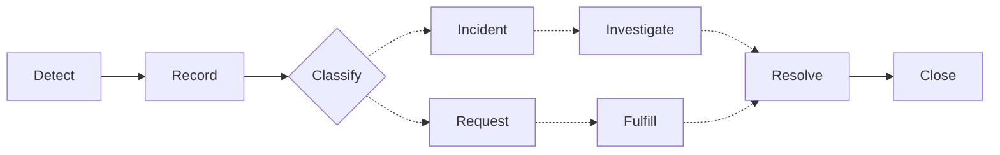
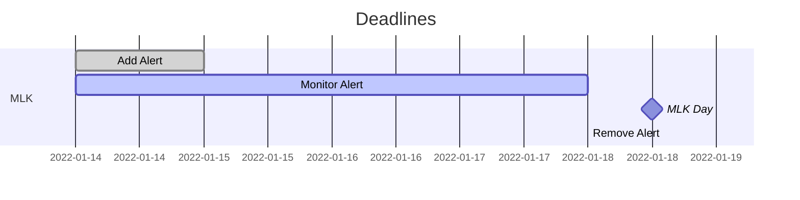

# Notes

## Current Websites
* [Admissions](https://admissions.ufl.edu)
* [Admissions Blog](https://admissions.ufl.edu/blog/)
* [Enrollment Management](https://em.ufl.edu)
* [Registrar](https://registrar.ufl.edu/)
* [Veterans Affairs](https://veterans.ufl.edu/)

<!--
## Emails
-->

## Useful Shortcuts

### General
| Windows | Web Browser | Xd | Zoom |
| :---: | :---: | :---: | :---: |
| Screen Record<br> `Win + Alt + R` | Recover Tab<br> `Ctrl + Shift + T` | Scroll Horizontally<br> `Shift + Scroll` | Hide Bar (for remote IT help)<br> `Ctrl + Alt + Shift + H` |
| Screen Capture<br> `Win + Shift + S` | | | Microphone Toggle<br> `Alt + A` |
| | | | Share Screen Prompt<br> `Alt + S` |

### Web Development

#### Bash (WIP)
`npm run dev` (admissions)

`npm run start` (em?)

#### Node
`npm install cmder` &rarr; Install Cmder

##### VSCode
From Command Prompt, `code .` opens current folder in code

##### Git (WIP)

##### Bookmarklets (WIP)
<!--
`javascript:alert($(window).height());` &rarr; Get current window height in a browser alert

`javascript:alert($(window).width());` &rarr; Get current window width in a browser alert

_Note: These cannot be copy/pasted into the URL and some pages may prevent the alert from appearing._
-->

## Terminology

### EM
Yield: Period in which students get accepted and decide where they will go to university

#### Designers
_Example View_

Orphan
```
    ~~~
    ~~~
~~~   
 x
```
Widow
```
     x
    ~~~
~~~ ~~~
~~~
```
Runt
```
     x
~~~ ~~~
~~~
~~~
```

### ITSM
#### ITSM Workflow Process


#### Incident Triage

|   | Low Impact | Medium Impact | High Impact |
| :---: |  :---: | :---: | :---: |
| Low Urgency | 1 | 2 | 3 |
| Medium Urgency | 2 | 3 | 4 |
| High Urgency | 3 | 4 | 5 |

*Impact: Number of users/items affected/influenced*
*Urgency: Based on time until significant impact*

### T4\*
[T4 Training Resources](https://webservices.it.ufl.edu/t4/t4-training/)

**\* Side project**

## In Progress

### Workflow

* Remember to frequently use `git fetch` and `git pull`

<!-- HIDDEN UF WORKFLOW TEMPLATE
#### mermaid


-->

[Mermaid Documentation](https://mermaid-js.github.io/mermaid/#/)
##### Flowchart
```
graph TD;
    A-->B;
    A-->C;
    B-->D;
    C-->D;
```  

##### Sequence Diagram
```
sequenceDiagram
    participant Alice
    participant Bob
    Alice->>John: Hello John, how are you?
    loop Healthcheck
        John->>John: Fight against hypochondria
    end
    Note right of John: Rational thoughts <br/>prevail!
    John-->>Alice: Great!
    John->>Bob: How about you?
    Bob-->>John: Jolly good!
```

##### Gantt Diagram
```mermaid
gantt MD;
dateFormat  YYYY-MM-DD
title Adding GANTT diagram to mermaid
excludes weekdays 2014-01-10

section A section
Completed task            :done,    des1, 2014-01-06,2014-01-08
Active task               :active,  des2, 2014-01-09, 3d
Future task               :         des3, after des2, 5d
Future task2               :         des4, after des3, 5d
```

### Hueso

#### Row
| M &rarr; L | B | M &rarr; T | B | M &rarr; L |
| :---: | :---: | :---: | :---: | :---: |
| 1 to 4 | 1 | 1 to 2 | 1 | 1 to 4 |

<!-- 
### Run

#### Naming Conventions
- camelCase for vars
- underscores for images
- dashes for filenames
-->

#### Tips
<details><summary>Very Basic Sass Filing and <a href="https://itnext.io/structuring-your-sass-projects-c8d41fa55ed4">Article on Sass Filing</a> with more complex suggestions</summary>
    <pre>
        _base.scss
        _layout.scss
        _components.scss
        main.scss
    </pre>
</details>
