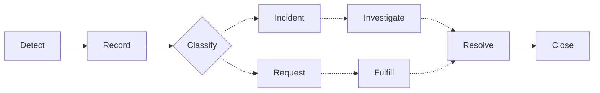
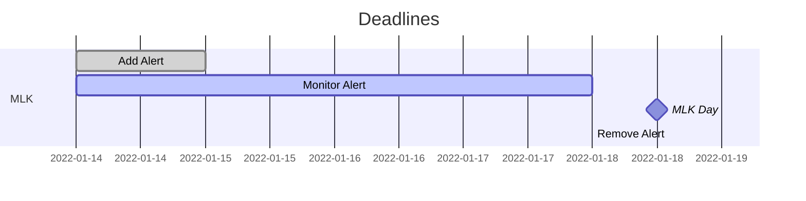
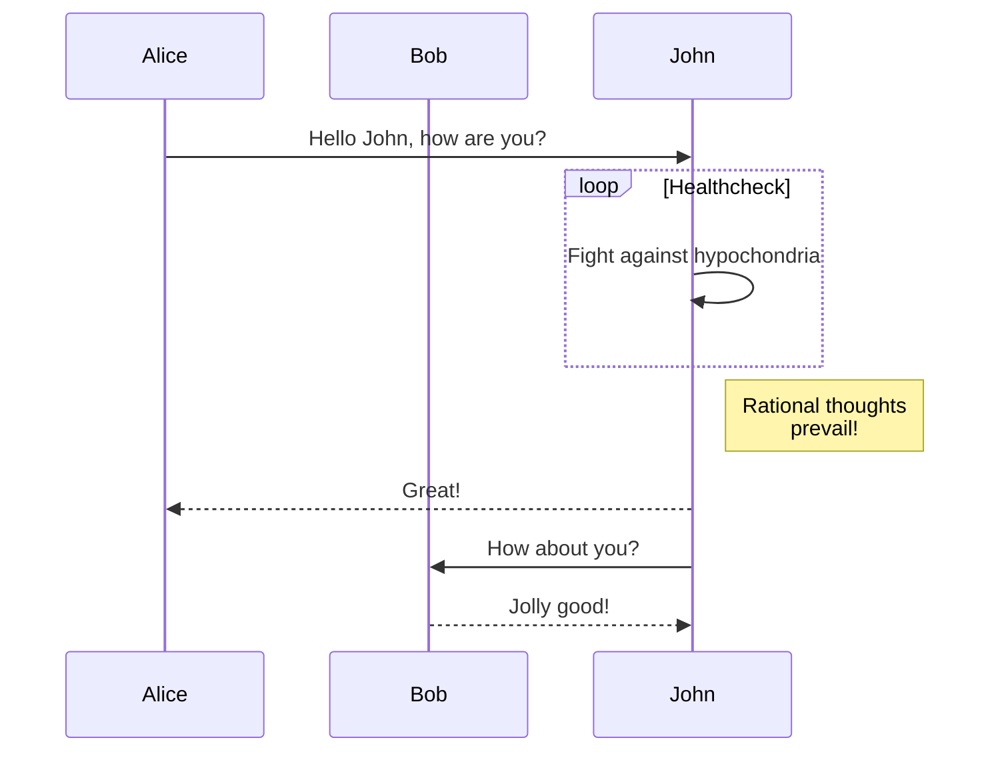
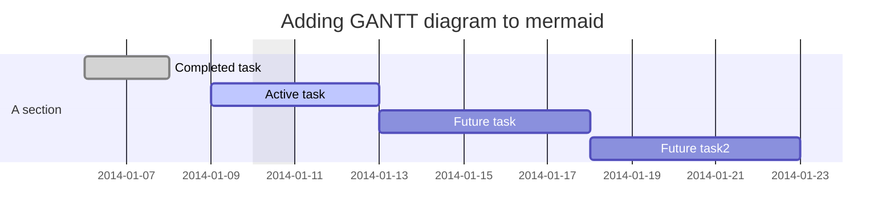

# Notes

## Websites
<details><summary>Main Websites</summary>
 
 * [Admissions](https://admissions.ufl.edu)
 * [Admissions Blog](https://admissions.ufl.edu/blog/)
 * [Enrollment Management](https://em.ufl.edu)
 * [Registrar](https://registrar.ufl.edu/)
 * [Veterans Affairs](https://veterans.ufl.edu/)
</details>


## Helpful Links

<details><summary>Web Accessibility</summary>
 
* [WebAIM Contrast Checker](https://open.spotify.com/track/2grjqo0Frpf2okIBiifQKs?si=003d98da1a004084)<br> _For manual checks for color contrast issues_
* [Font Size Change in Browser for Users](https://www.computerhope.com/issues/ch000779.htm#:~:text=Press%20and%20hold%20the%20Ctrl,and%20decrease%20the%20font%20size.)<br> _To see how people use resizing to view content better_
</details>

<details><summary>Design/Development</summary>
 
* [HTML URL Encoding Reference](https://www.w3schools.com/tags/ref_urlencode.ASP)<br> _For use with API calls with input text_
* [Squoosh](https://squoosh.app/)<br> _For making image files smaller so they load faster (not necessary if using Image Optimizer on macOS)_
* [Lorem Picsum](https://picsum.photos/)<br> _For populating with random image with specified measurements_
* [Image Optimization Perspective](https://www.jimdo.com/blog/optimize-website-images-for-better-design-seo/)
* [Git Stash Explained](https://www.freecodecamp.org/news/git-stash-explained/)
</details>
 
<!-- [myAssets - External User Portal](https://myassets.fa.ufl.edu/ext/#/home)<br> _For foreign travel requests, off-site certification for assets and online shopping_ -->
<!-- * [13 Days of Accessibility](http://a11ycalendar.kaseybon.com/)<br> _For gradually learning accessibility standards_ -->
<!-- [Apple Typography](https://developer.apple.com/design/human-interface-guidelines/ios/visual-design/typography/)<br> _For accessibility with research-backed data_ -->
<!-- [Create timezone date without string representation](https://stackoverflow.com/questions/439630/create-a-date-with-a-set-timezone-without-using-a-string-representation/439871#439871) -->
<!-- [Source for some window size functions](https://www.rapidtables.com/web/tools/window-size.html) _For getting window size and other useful utilities_ -->

<!--
## Emails
-->

## Personal Naming Conventions Preferences
- **_camelCase_** for variables
    - camelCaseExample
- **_underscores_** for images
    - underscore_example
- **_dashes_** for filenames/folders
    - filename-or-folder-example

## Useful Shortcuts

### General
| Windows | Web Browser | Xd | Zoom |
| :---: | :---: | :---: | :---: |
| Screen Record<br> `Win + Alt + R` | Recover Tab<br> `Ctrl + Shift + T` | Scroll Horizontally<br> `Shift + Scroll` | Hide Bar (for remote IT help)<br> `Ctrl + Alt + Shift + H` |
| Screen Capture<br> `Win + Shift + S` | |Select items over area<br> `Shift + Click/Drag`| Microphone Toggle<br> `Alt + A` |
| | | | Share Screen Prompt<br> `Alt + S` |

### Web Development

<details><summary>Bash (WIP)</summary>
 <code>npm run dev</code> <span>(admissions)</span>
 <code>npm run start</code> <span>(em?)</span>
</details>

#### Node
`npm install cmder` &rarr; Install Cmder

##### VSCode
From Command Prompt, `code .` opens current folder in code

##### Git (WIP)
* `git cherry-pick`
  * `git cherry-pick commit-SHA` _Merges a particular commit_
  * `git cherry-pick first-commit-SHA-in-range^..last-commit-SHA-in-range` _Merges a range of commits including the first in range_
    * In `git cherry-pick A..B`, A should be older than B
  * `git cherry-pick first-commit-SHA-in-range..last-commit-SHA-in-range` _Merges a range of commits **NOT** including the first in range_

##### Dev Tools
* `[].forEach.call($$("*"),function(a){a.style.outline="1px solid #"+(~~(Math.random()*(1<<24))).toString(16)})` _Input in console: Helpful for checking element padding_

##### Bookmarklets (WIP)
<!--
[Source for some window size functions](https://www.rapidtables.com/web/tools/window-size.html)

`javascript:alert($(window).height());` &rarr; Get current window height in a browser alert

`javascript:alert($(window).width());` &rarr; Get current window width in a browser alert

_Note: These cannot be copy/pasted into the URL and some pages may prevent the alert from appearing._
-->

## Terminology

### EM
Yield: Period in which students get accepted and decide where they will go to university

#### Designers
_Example View_

Orphan
```
    ~~~
    ~~~
~~~   
 x
```
Widow
```
     x
    ~~~
~~~ ~~~
~~~
```
Runt
```
     x
~~~ ~~~
~~~
~~~
```

### ITSM
#### ITSM Workflow Process


#### Incident Triage

|   | Low Impact | Medium Impact | High Impact |
| :---: |  :---: | :---: | :---: |
| Low Urgency | 1 | 2 | 3 |
| Medium Urgency | 2 | 3 | 4 |
| High Urgency | 3 | 4 | 5 |

*Impact: Number of users/items affected/influenced*
*Urgency: Based on time until significant impact*

### T4\*
[T4 Training Resources](https://webservices.it.ufl.edu/t4/t4-training/)

**\* Side project**

## In Progress

### Workflow

* Remember to frequently use `git fetch` and `git pull`

<!-- HIDDEN UF WORKFLOW TEMPLATE
#### mermaid


-->

[Mermaid Documentation](https://mermaid-js.github.io/mermaid/#/)
##### Flowchart


##### Sequence Diagram


##### Gantt Diagram



### Hueso

#### Row
| M &rarr; L | B | M &rarr; T | B | M &rarr; L |
| :---: | :---: | :---: | :---: | :---: |
| 1 to 4 | 1 | 1 to 2 | 1 | 1 to 4 |

#### Tips
<details><summary>Very Basic Sass Filing and <a href="https://itnext.io/structuring-your-sass-projects-c8d41fa55ed4">Article on Sass Filing</a> with more complex suggestions</summary>
    <pre>
        _base.scss
        _layout.scss
        _components.scss
        main.scss
    </pre>
</details>
