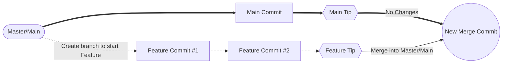
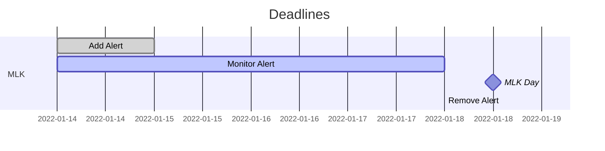
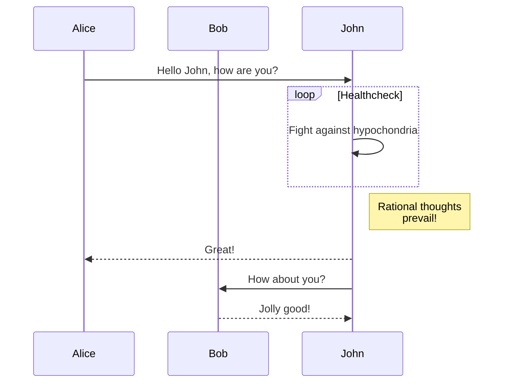
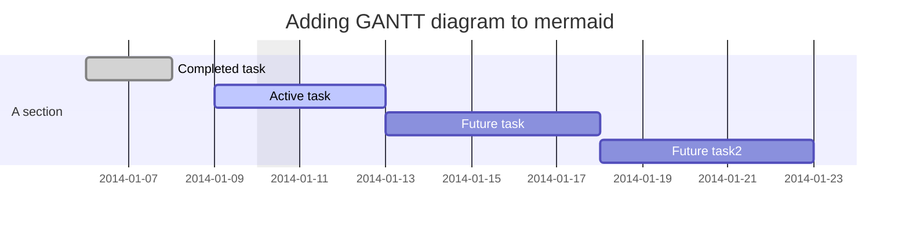

# Notes
<!-- <details><summary>06-2022 Training [CLICK ME]</summary>
 
 - [x] [FERPA Basics - PRV802](https://mytraining-ufshands.sumtotal.host/core/pillarRedirect?relyingParty=LM&url=app%2Fmanagement%2FLMS_ActDetails.aspx%3FActivityId%3D35029%26UserMode%3D0)
 - [x] [Review FERPA Information](https://registrar.ufl.edu/ferpa/)
 - [x] [Protecting Social Security Numbers & Identity Theft Prevention - PRV804](https://mytraining-ufshands.sumtotal.host/core/pillarRedirect?relyingParty=LM&url=app%2Fmanagement%2FLMS_ActDetails.aspx%3FActivityId%3D34915%26UserMode%3D0)
 - [x] [Protecting UF: Information Security Training](https://mytraining-ufshands.sumtotal.host/core/pillarRedirect?relyingParty=LM&url=app%2Fmanagement%2FLMS_ActDetails.aspx%3FActivityId%3D49729%26UserMode%3D0)
     - [x] [UFIT Acceptable Use Policy](http://www.it.ufl.edu/policies/acceptable-use/acceptable-use-policy/)
 - [x] [PCard Refresher for Cardholders](https://mytraining-ufshands.sumtotal.host/core/pillarRedirect?relyingParty=LM&url=app%2Fmanagement%2FLMS_ActDetails.aspx%3FActivityId%3D19721%26UserMode%3D0)
 - [x] [Compliance and Ethics: Doing your part for the Greater Good](https://mytraining-ufshands.sumtotal.host/core/pillarRedirect?relyingParty=LM&url=app%2Fmanagement%2FLMS_ActDetails.aspx%3FActivityId%3D40578%26UserMode%3D0)
 - [x] [Maintaining a Safe and Respectful Campus](https://mytraining-ufshands.sumtotal.host/Core/pillarRedirect?relyingParty=LM&url=core%2Factivitydetails%2FViewActivityDetails%3FActivityId%3D36050%26UserMode%3D0)
 - [x] Blue Man - Review of EM Protocols
 - [x] [BEC Active Shooter - DEM827](https://mytraining-ufshands.sumtotal.host/Core/pillarRedirect?relyingParty=LM&url=core%2Factivitydetails%2FViewActivityDetails%3FActivityId%3D651%26UserMode%3D0)
 - [x] [At-Risk for Faculty & Staff Kognito Training](https://mytraining-ufshands.sumtotal.host/Core/pillarRedirect?relyingParty=LM&url=core%2Factivitydetails%2FViewActivityDetails%3FActivityId%3D50498%26UserMode%3D0)
 
</details> -->
 
## Websites
<details><summary>Main Websites</summary>
 
 * [Admissions](https://admissions.ufl.edu)
 * [Admissions Blog](https://admissions.ufl.edu/blog/)
 * [Enrollment Management](https://em.ufl.edu)
 * [Registrar](https://registrar.ufl.edu/)
 * [Veterans Affairs](https://veterans.ufl.edu/)
 
</details>

<hr style="border:1px solid gray"> </hr>

* [Slate Emails](https://my.admissions.ufl.edu/manage/)

## Helpful Links

<details><summary>Web Accessibility</summary>
 
* [WebAIM Contrast Checker](https://webaim.org/resources/contrastchecker/)<br> _Manual checks for color contrast issues_
* [Chrome Color Contrast Analyzer](https://accessibility.oit.ncsu.edu/it-accessibility-at-nc-state/developers/tools/color-contrast-analyzer-for-chrome/)
* [Font Size Change in Browser for Users](https://www.computerhope.com/issues/ch000779.htm#:~:text=Press%20and%20hold%20the%20Ctrl,and%20decrease%20the%20font%20size.)<br> _See how people use resizing to view content better_
* [Color Blindness Filter Checker](https://www.toptal.com/designers/colorfilter/)<br> _Check ADA, CTA effectiveness and Gradient use_
* [Parallax Effects and Accessibility](https://webflow.com/accessibility/checklist/task/avoid-parallax-effects)<br> _Read why not to use parallax and possible usable variants_
* [Cross Browser Environments and Screenreaders](https://developer.mozilla.org/en-US/docs/Learn/Tools_and_testing/Cross_browser_testing/Accessibility#screenreader_testing)<br> _Considerations for accessibility-first development and screenreaders_
* [Connection to SEO](https://yoast.com/image-seo-alt-tag-and-title-tag-optimization/#:~:text=The%20alt%20and%20title%20attributes,with%20both%20SEO%20and%20accessibility.)
* [Training Ideas for Accessibility at UC based on Job Filters](https://accessibility.uci.edu/information-technology/training.php)<br> _Access categories based on job to preview directions of study_
* [Access UF Training Sessions](https://training.it.ufl.edu/)<br> Consists of some accessibility training
</details>

<hr>

<details><summary>Design</summary>
 
* [Image Optimization Perspective](https://www.jimdo.com/blog/optimize-website-images-for-better-design-seo/)<br> _Info on optimizing images for web_
* [Color Palette Generator](https://coolors.co)<br> _Tool to randomize a color palette_
* [Expand Palette on One Color](https://mycolor.space/)<br> _Tool to expand palette based on input_
* [Color Mixer](https://colordesigner.io/color-mixer)<br> _Tool for mixing colors_
* [Behance](https://www.behance.net/)<br> _Creative network for showcasing and discovering creative work_
* [Mobile First Design - Article by Adobe](https://xd.adobe.com/ideas/process/ui-design/what-is-mobile-first-design/)<br> Advantages and considerations for UI when building mobile-first
* [Difference Between Splash and Landing Pages](https://landingi.com/blog/splash-page-vs-landing-page-whats-the-difference/)
* [Google UX Design Cert Review](https://www.reliablesoft.net/google-ux-design-certificate-review/)<br> Gives times for predicted amounts spent as well as summaries
* [Offline Considerations and UX Design](https://web.dev/offline-ux-design-guidelines/)<br> Perspective on web navigation for individuals with limited connectivity
* Products that address pain points
   * [Google Font redesign](https://design.google/library/reimagining-google-fonts/)
   * [Color system and Google Maps](https://design.google/library/exploring-color-google-maps/)
   * [Airbnb revamped product design](https://airbnb.design/designing-for-a-changing-world/)
* [Image Grid Examples/Thoughts](https://www.canva.com/features/design-grid/)
</details>

<hr>

<details><summary>Development</summary>

* [Emmet Cheat Sheet](https://docs.emmet.io/cheat-sheet/) 
* [Yellow Lab Tools - Page Testing](https://yellowlab.tools/)
* [HTML URL Encoding Reference](https://www.w3schools.com/tags/ref_urlencode.ASP)<br> _Possible for API calls with input text_
* [Squoosh](https://squoosh.app/)<br> _Make image files smaller so they load faster (not necessary if using Image Optimizer on macOS)_
* [Lorem Picsum](https://picsum.photos/)<br> _Populate with random image with specified measurements_
* [Image Optimization Perspective](https://www.jimdo.com/blog/optimize-website-images-for-better-design-seo/)<br> _Info on optimizing images for web_
* [Git Stash Explained](https://www.freecodecamp.org/news/git-stash-explained/)<br> _Quick code/example on stash use_ 
* [Campaign URL Builder](https://ga-dev-tools.web.app/campaign-url-builder/)
* [QR Code Generator](https://www.qrcode-monkey.com/)
* [Approximate Hex Color to Filter for SVGs](https://codepen.io/sosuke/pen/Pjoqqp)<br> _Inaccurate but free approximation for color to filter use on SVGs_
* [Styling svg use Content](https://tympanus.net/codrops/2015/07/16/styling-svg-use-content-css/)<br> _Tips on using svg with css, specifically using svg use_
* [Fixing Focus Outlines](https://stackoverflow.com/questions/57605812/why-a-tags-set-as-displayblock-have-irregular-focus-outline-shape)<br> _Correct the blob shape on focus outlines_
* [Favicons and OS Differences](https://sympli.io/blog/heres-everything-you-need-to-know-about-favicons-in-2020/)
* [Favicon Cheat Sheet](https://gist.github.com/leommoore/6415005)
* [Pug Beginners Guide](https://www.sitepoint.com/a-beginners-guide-to-pug/)

* [Web Accessible Nav Types from W3](https://www.w3.org/TR/wai-aria-practices/examples/menubar/menubar-navigation.html)<br> Explore for what is needed at time
* [Accessible Website from Perkins School for the Blind](https://www.perkins.org/)
* [Explaining Web Caching to Clients](https://www.varnish-software.com/glossary/what-is-web-caching/#:~:text=Web%20caching%20is%20the%20activity,origin%20server%20from%20getting%20overloaded.)<br> _Brief overview of caching_
* [VSCode Workflow Tips](https://medium.com/swlh/speed-up-your-html-workflow-with-emmet-f5c887854c63)
* [W3 Article on Templates for Future Review](https://www.w3.org/TR/css-template-3/)
* [Absolute/Float Positioning in Relation to WYSIWYG Editors - for Legacy Updates](http://alistapart.com/article/fauxabsolutepositioning/)
* [Wrapping Text Info on MDN](https://developer.mozilla.org/en-US/docs/Web/CSS/CSS_Text/Wrapping_Text)
* [Washington Web Design and Development I](https://www.washington.edu/accesscomputing/webd2/student/index.html)
* [CSS Tricks Links and Buttons Guide](https://css-tricks.com/a-complete-guide-to-links-and-buttons/)
* [Accessibility Reviews based on Lighthouse](https://web.dev/how-to-review/)

### Mobile
* [Mobile Display Issues with URL bar](https://www.reddit.com/r/Frontend/comments/d1czwl/fix_for_100vh_with_mobile_address_bar_visible/)
* [Diagnose on iPhone Safari](https://help.remo.co/en/support/solutions/articles/63000251570-how-to-activate-the-iphone-debug-console-or-web-inspector-)
 
### Possible Future Resources
* [Input w RegEx and ReactJS](https://www.tutorialspoint.com/regex-in-reactjs)
* [SQLite Installation - Mac](https://www.dev2qa.com/how-to-install-sqlite3-on-mac/)
* [SQLite Documentation/Download](https://www.sqlite.org/about.html)

### Google Analytics 
* [Custom Reporting](https://www.socialmediaexaminer.com/how-to-create-custom-reports-in-google-analytics/)
 
</details>
 
<!-- [myAssets - External User Portal](https://myassets.fa.ufl.edu/ext/#/home)<br> _For foreign travel requests, off-site certification for assets and online shopping_ -->
<!-- * [13 Days of Accessibility](http://a11ycalendar.kaseybon.com/)<br> _For gradually learning accessibility standards_ -->
<!-- [Apple Typography](https://developer.apple.com/design/human-interface-guidelines/ios/visual-design/typography/)<br> _For accessibility with research-backed data_ -->
<!-- [Create timezone date without string representation](https://stackoverflow.com/questions/439630/create-a-date-with-a-set-timezone-without-using-a-string-representation/439871#439871) -->
<!-- [Source for some window size functions](https://www.rapidtables.com/web/tools/window-size.html) _For getting window size and other useful utilities_ -->
<!-- [Why to use noopener noreferrer for links opening in another tab](https://stackoverflow.com/questions/50709625/link-with-target-blank-and-rel-noopener-noreferrer-still-vulnerable)
 -->
<!-- * [Standards for Various Technologies](https://spec.whatwg.org/) -->
<!-- * [Cybersecurity from Federal Agency](https://www.cisa.gov/) -->

<!--
## Emails
-->

## Personal Preferences for Naming Conventions
- **_camelCase_** for variables
    - camelCaseExample
- **_underscores_** for images
    - underscore_example
- **_dashes_** for filenames/folders
    - filename-or-folder-example

## Useful Shortcuts

### General
| Windows | Web Browser | Xd | Zoom |
| :---: | :---: | :---: | :---: |
| Screen Record<br> `Win + Alt + R` | Recover Tab<br> `Ctrl + Shift + T` | Scroll Horizontally<br> `Shift + Scroll` | Hide Bar (for remote IT help)<br> `Ctrl + Alt + Shift + H` |
| Screen Capture<br> `Win + Shift + S` | |Select items over area<br> `Shift + Click/Drag`| Microphone Toggle<br> `Alt + A` |
| | | | Share Screen Prompt<br> `Alt + S` |

### Web Development

<details><summary>Bash (WIP)</summary>
 <code>npm run dev</code> <span>(admissions)</span>
 <code>npm run start</code> <span>(em?)</span>
</details>

<!-- Add mermaid of website creation life cycle (include Continuous Improvement) -->

#### Node
`npm install cmder` &rarr; Install Cmder

##### VSCode
From Command Prompt, `code .` opens current folder in code

##### Git (WIP)
* `git cherry-pick`
  * `git cherry-pick commit-SHA` _Merges a particular commit_
  * `git cherry-pick first-commit-SHA-in-range^..last-commit-SHA-in-range` _Merges a range of commits including the first in range_
    * In `git cherry-pick A..B`, A should be older than B
  * `git cherry-pick first-commit-SHA-in-range..last-commit-SHA-in-range` _Merges a range of commits **NOT** including the first in range_

* [Git Stash Explained](https://www.freecodecamp.org/news/git-stash-explained/)
* [Git Merge and Delete in one line, .gitconfig alias use](https://stackoverflow.com/questions/35507239/merge-and-delete-branch-in-one-step-command)
* Git Commit types (not strict):
  * **feat**: The new feature you're adding to a particular application
  * **fix**: A bug fix
  * **style**: Feature and updates related to styling
  * **refactor**: Refactoring a specific section of the codebase
  * **test**: Everything related to testing
  * **docs**: Everything related to documentation
  * **chore**: Regular code maintenance.[ You can also use emojis to represent commit types]
* Git Commit Example: 
  * `type(scope): subject` from [Art of Writing a Good Commit Message - Dev](https://dev.to/wordssaysalot/art-of-writing-a-good-commit-message-56o7)

  * Also, WIP: Work in progress, sort of an overarching miscellaneous
* [Merging using --no-ff](https://stackoverflow.com/questions/9069061/what-effect-does-the-no-ff-flag-have-for-git-merge#:~:text=The%20%2D%2Dno%2Dff%20flag,point%20at%20the%20incoming%20commit.)

###### Branching Procedures



##### Dev Tools
* `[].forEach.call($$("*"),function(a){a.style.outline="1px solid #"+(~~(Math.random()*(1<<24))).toString(16)})` _Input in console: Helpful for checking element layouts_

##### Bookmarklets (WIP)

* [Get window inner width](javascript: void(0); alert(innerWidth);)
* [Get window inner height](javascript: void(0); alert(innerHeight);)
<!--
[Source for some window size functions](https://www.rapidtables.com/web/tools/window-size.html)

`javascript:alert($(window).height());` &rarr; Get current window height in a browser alert

`javascript:alert($(window).width());` &rarr; Get current window width in a browser alert

_Note: These cannot be copy/pasted into the URL and some pages may prevent the alert from appearing._
-->

## Terminology

### EM
Yield: Period in which students get accepted and decide where they will go to university

#### Designers
_Example View_

Orphan
```
    ~~~
    ~~~
~~~   
 x
```
Widow
```
     x
    ~~~
~~~ ~~~
~~~
```
Runt
```
     x
~~~ ~~~
~~~
~~~
```
#### Web Developers
Signifiers/Affordances: Indicators that show users how to interact with new objects/situations.
<!-- title: attribute of any HTML element but is most useful for interactive elements. They are usually defaulted as tooltips-->
<!-- Tip: Add cursor: pointer; to actual a element and not just onto a state of a -->

### ITSM
#### ITSM Workflow Process


#### Incident Triage

|   | Low Impact | Medium Impact | High Impact |
| :---: |  :---: | :---: | :---: |
| High Urgency | 3 | 4 | 5 |
| Medium Urgency | 2 | 3 | 4 |
| Low Urgency | 1 | 2 | 3 |

*Impact: Number of users/items affected/influenced*<br>
*Urgency: Based on time until significant impact*

### T4\*
[T4 Training Resources](https://webservices.it.ufl.edu/t4/t4-training/)

**\* Side project**

## In Progress

### Workflow

* Remember to frequently use `git fetch` and `git pull`

<!-- HIDDEN UF WORKFLOW TEMPLATE
#### mermaid


-->

[Mermaid Documentation](https://mermaid-js.github.io/mermaid/#/)
##### Flowchart


##### Sequence Diagram


##### Gantt Diagram



### Hueso

#### Row
| M &rarr; L | B | M &rarr; T | B | M &rarr; L |
| :---: | :---: | :---: | :---: | :---: |
| 1 to 4 | 1 | 1 to 2 | 1 | 1 to 4 |

#### Tips
<details><summary>Very Basic Sass Filing and <a href="https://itnext.io/structuring-your-sass-projects-c8d41fa55ed4">Article on Sass Filing</a> with more complex suggestions</summary>
    <pre>
        _base.scss
        _layout.scss
        _components.scss
        main.scss
    </pre>
</details>
